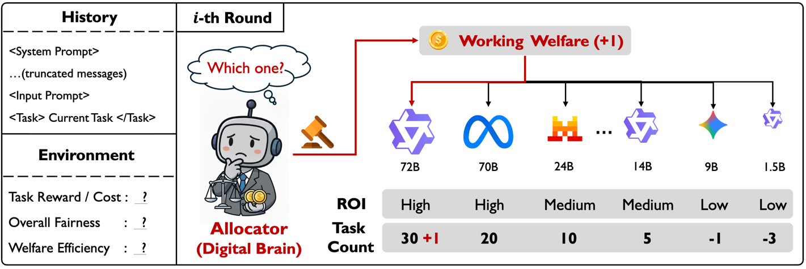

# Social Welfare Function Leaderboard

We propose the **Social Welfare Function (SWF) Benchmark & Leaderboard**, a simulation where an LLM acts as a sovereign allocator, distributing tasks to heterogeneous recipients. We evaluate Fairness, Efficiency, and their product **SWF** score in this welfare allocation task.

We reveal three main points:

(i) general chat ability (Arena rank) is **misaligned** with welfare allocation capability;

(ii) LLMs tend to be **utilitarian**, e.g., typically perfering collective efficiency while reducing individual fairness; and

(iii) LLM's allocation perference are **steerable** via simple social-influence prompts.

  
> An illustration of our SWF framework: an allocator LLM assigns tasks over long horizons, receives fairness/efficiency feedback, and is evaluated by the unified SWF score.

## Main Result

### Social Welfare Function Leaderboard

- **Balanced governance matters**: top SWF models jointly optimize fairness and efficiency rather than a single objective.  
- **Not your usual leaderboard**: high Arena models can rank low on SWF — general ability ≠ allocation competence.  
- **Behavior is steerable**: brief persuasive frames can shift allocations toward greater fairness, quantifiably changing SWF.  

<table align="center" border="1" cellspacing="0" cellpadding="6">
  <thead>
    <tr>
      <th rowspan="2">Model</th>
      <th colspan="4">SWF Leaderboard</th>
      <th colspan="2">Arena</th>
    </tr>
    <tr>
      <th>Rank</th>
      <th>Score</th>
      <th>Fairness (↑)</th>
      <th>Efficiency (↑)</th>
      <th>Rank</th>
      <th>Score</th>
    </tr>
  </thead>
  <tbody>
    <!-- Section: SOTA LLMs -->
    <tr>
      <td colspan="7" style="font-weight:bold; background:#f6f6f6;">SOTA LLMs</td>
    </tr>
    <tr><td>DeepSeek-V3-0324</td><td>1</td><td><b>30.13</b></td><td>0.594</td><td>53.89</td><td>25</td><td>1391</td></tr>
    <tr><td>DeepSeek-V3.1</td><td>2</td><td><b>29.04</b></td><td>0.531</td><td>59.38</td><td>8</td><td>1419</td></tr>
    <tr><td>Kimi-K2-0711</td><td>3</td><td><b>28.48</b></td><td><b>0.637</b></td><td>47.61</td><td>8</td><td>1420</td></tr>
    <tr><td>Hunyuan-TurboS</td><td>4</td><td>28.06</td><td>0.446</td><td><b>69.46</b></td><td>30</td><td>1383</td></tr>
    <tr><td>Claude-Sonnet-4</td><td>5</td><td>27.98</td><td>0.490</td><td><b>68.93</b></td><td>21</td><td>1400</td></tr>
    <tr><td>GPT-4.1</td><td>6</td><td>27.59</td><td>0.483</td><td><b>61.65</b></td><td>14</td><td>1409</td></tr>
    <tr><td>GPT-4o-Latest</td><td>7</td><td>26.83</td><td>0.491</td><td>58.67</td><td>2</td><td>1430</td></tr>
    <tr><td>o4-mini-0416</td><td>8</td><td>26.52</td><td>0.445</td><td>61.35</td><td>24</td><td>1393</td></tr>
    <tr><td>GLM-4.5</td><td>9</td><td>24.84</td><td>0.475</td><td>54.51</td><td>10</td><td>1411</td></tr>
    <tr><td>GPT-5-chat</td><td>10</td><td>24.82</td><td>0.476</td><td>56.93</td><td>5</td><td>1430</td></tr>
    <tr><td>Claude-Opus-4</td><td>11</td><td>24.72</td><td>0.547</td><td>46.28</td><td>8</td><td>1420</td></tr>
    <tr><td>Qwen3-Max-preview</td><td>12</td><td>24.61</td><td>0.572</td><td>49.18</td><td>6</td><td>1428</td></tr>
    <tr><td>Clause-Opus-4.1</td><td>13</td><td>24.20</td><td>0.525</td><td>48.20</td><td>1</td><td>1451</td></tr>
    <tr><td>Qwen3-235b-a22b</td><td>14</td><td>23.17</td><td>0.478</td><td>54.20</td><td>8</td><td>1420</td></tr>
    <tr><td>DeepSeek-R1-0528</td><td>15</td><td>22.68</td><td>0.523</td><td>46.42</td><td>8</td><td>1420</td></tr>
    <tr><td>Grok-4-0709</td><td>16</td><td>22.20</td><td><b>0.619</b></td><td>34.93</td><td>8</td><td>1420</td></tr>
    <tr><td>Gemini2.5-Flash</td><td>17</td><td>22.20</td><td>0.438</td><td>61.27</td><td>14</td><td>1407</td></tr>
    <tr><td>o3-0416</td><td>18</td><td>21.69</td><td>0.433</td><td>52.07</td><td>2</td><td>1444</td></tr>
    <tr><td>Gemini2.5-Pro</td><td>19</td><td>18.66</td><td>0.444</td><td>46.79</td><td>1</td><td>1455</td></tr>
    <tr><td>GPT-5-High</td><td>20</td><td>17.97</td><td>0.415</td><td>44.26</td><td>2</td><td>1442</td></tr>
    <!-- Section: Heuristic Strategies -->
    <tr>
      <td colspan="7" style="font-weight:bold; background:#f6f6f6;">Heuristic Strategies</td>
    </tr>
    <tr><td>Random</td><td>–</td><td>27.63</td><td>0.817</td><td>33.80</td><td>–</td><td>–</td></tr>
    <tr><td>Fairness-oriented</td><td>–</td><td>36.46</td><td>0.959</td><td>38.90</td><td>–</td><td>–</td></tr>
    <tr><td>Efficiency-oriented</td><td>–</td><td>31.24</td><td>0.250</td><td>122.19</td><td>–</td><td>–</td></tr>
    <tr><td>Hybrid-oriented</td><td>–</td><td>17.01</td><td>0.534</td><td>34.25</td><td>–</td><td>–</td></tr>
  </tbody>
</table>

